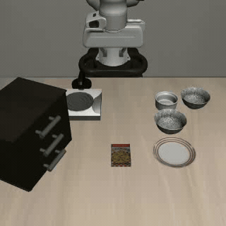
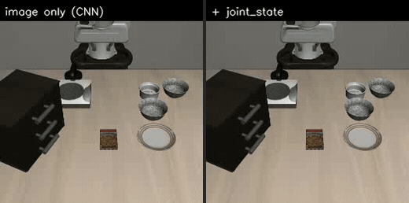

# Behavior Cloning on LIBERO

A small behavior-cloning policy trained on 50 human demonstrations of a single
LIBERO-Spatial task:

> *pick up the black bowl between the plate and the ramekin and place it on the plate*

<p align="center">
  <br>
  <em>Final policy — task solved at step 156 of a 1000-step horizon.</em>
</p>

---

## Image-only CNN vs. adding `joint_state`

The first question this repo set out to answer: does the policy need
proprioception, or is the camera enough?

The image-only variant fed a single 128×128 `agentview` frame through three
conv layers into two fully-connected layers. It *accepted* a `joint_state`
argument and silently dropped it. The second variant concatenates the raw 9-dim
proprio vector — `robot0_joint_pos` (7) + `robot0_gripper_qpos` (2) — onto the
flattened conv features before the first FC layer.

<p align="center">
  <br>
  <em>Left: image only. Right: + joint_state. Both fail the same way.</em>
</p>

### Stats

| | image only | + `joint_state` |
|---|---|---|
| policy input | agentview 128×128 | agentview 128×128 + proprio (9) |
| `linear1` input width | 9216 | 9225 |
| parameters | 2.50 M | 2.51 M |
| training iterations | ~10,000 | 10,000 |
| best training L1 | not recorded | **0.0312** |
| rollout result | no success in 1000 steps | no success in 1000 steps |
| failure mode | reaches bowl, drags it off the table | reaches bowl, drags it off the table |

**Adding `joint_state` did not change the outcome.** Both policies approach the
bowl roughly correctly and then sweep it off the table. On this task, at this
scale, proprioception was not the missing ingredient.

### What the proprio model's error breakdown revealed

Per-dimension L1 on 1024 training samples, `+ joint_state` at 10k iterations:

| dim | true \|mean\| | L1 error | share of total loss |
|---|---|---|---|
| dx | 0.432 | 0.053 | 11.7% |
| dy | 0.168 | 0.036 | 7.9% |
| dz | 0.503 | 0.060 | 13.2% |
| droll | 0.029 | 0.012 | 2.7% |
| dpitch | 0.053 | 0.018 | 3.9% |
| dyaw | 0.046 | 0.012 | 2.7% |
| **gripper** | **1.000** | **0.260** | **57.8%** |

The gripper command in the demonstrations is binary — `torch.unique` over the
action column returns exactly `[-1.0, +1.0]` — but it was being regressed with
L1 through a `tanh` alongside six continuous deltas. It consumed **58% of the
loss budget** while still getting the sign wrong on **13%** of training steps.
A gripper that opens mid-lift is exactly the observed failure.

That diagnosis, not the proprio input itself, is what the comparison was
actually worth.

---

## What did solve the task

Three changes on top of the `+ joint_state` model:

1. **Wrist camera** (`eye_in_hand_rgb`) as a second conv trunk with its own
   weights. The dataloader was already stacking it into every batch and nothing
   read it. Whether the bowl rim sits between the fingers is not visible from
   agentview at 128×128.
2. **Gripper as a binary head** trained with `binary_cross_entropy_with_logits`,
   separate from L1 on the six continuous deltas.
3. **100,000 iterations** instead of 10,000. The model was still clearly
   underfit at 10k.

| | + `joint_state` (10k) | final (100k) |
|---|---|---|
| training loss | 0.0312 | **0.0052** (cont 0.0049, grip 0.0000) |
| gripper sign agreement | 87.0% | **100.0%** |
| dz L1 | 0.060 | 0.037 |
| dy L1 | 0.036 | 0.027 |
| rollout | no success in 1000 steps | **success at step 156** |

### Caveats

These are not controlled ablations. Iteration counts differ between rows, every
rollout is a single episode from a single initial state, and there is no
held-out validation split — every loss number above is training loss. The table
shows what was run, not a measured success rate.

---

## Running it

```bash
python train.py   # 100k iterations, ~22 min on a T4
python test.py    # loads checkpoints/bc_network, writes rollout.mp4
```

Training is headless-safe. Evaluation renders offscreen and writes an mp4
rather than opening a window, so it works over SSH with no X display.

### Files

| file | purpose |
|---|---|
| `model.py` | `ConvEncoder` per camera, shared FC trunk, split continuous/gripper heads |
| `agent.py` | training loop, rollout + video recording, checkpointing |
| `env_wrapper.py` | collapses the LIBERO obs dict to `(agentview, wrist, joint_state)` |
| `dataloader.py` | robomimic-backed sampler over the demo HDF5 |

### Rollout videos

| file | policy |
|---|---|
| `rollout.mp4` | final — solves the task |
| `rollout_agentview_only.mp4` | agentview + `joint_state`, 10k iterations |
| `rollout_image_only.mp4` | agentview only |
